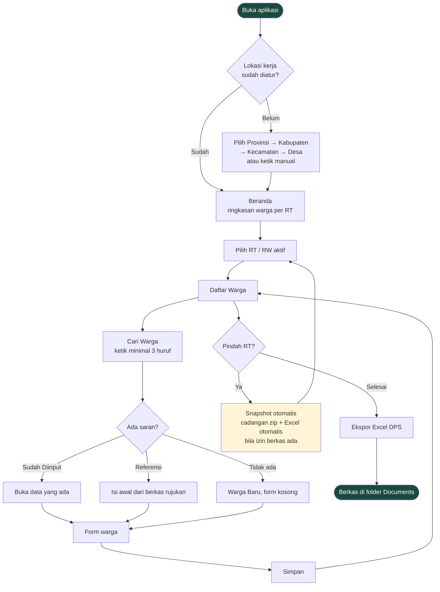
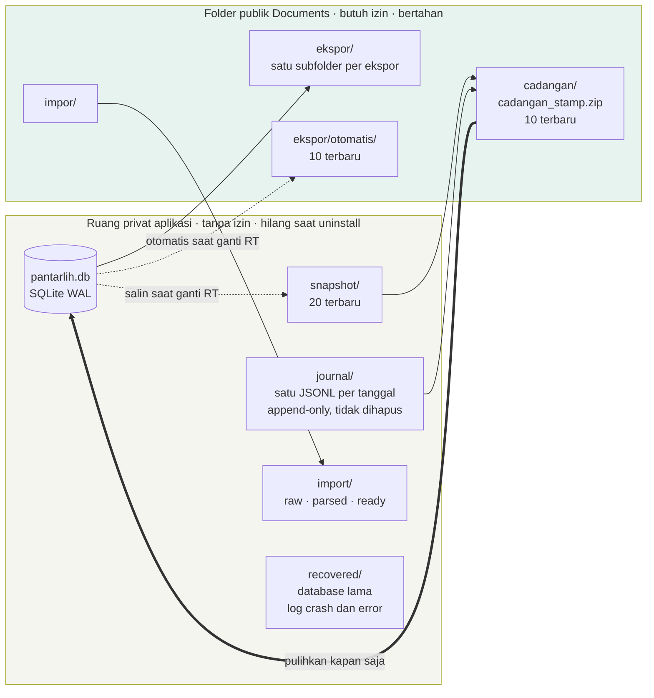
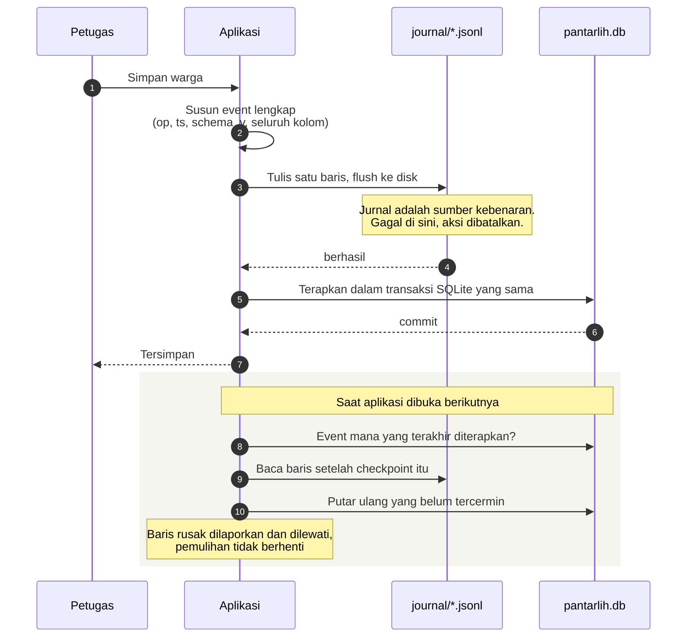
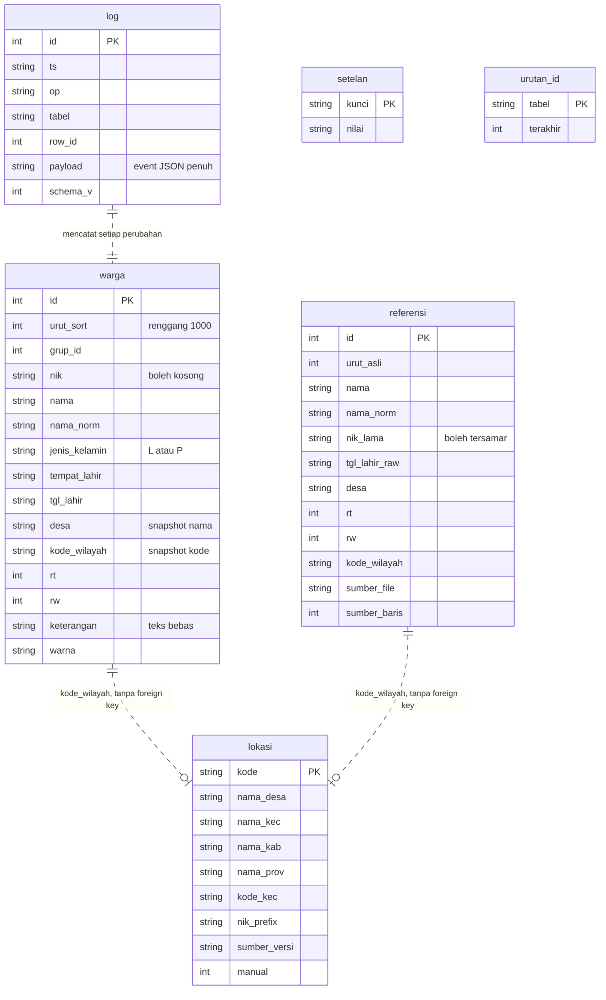
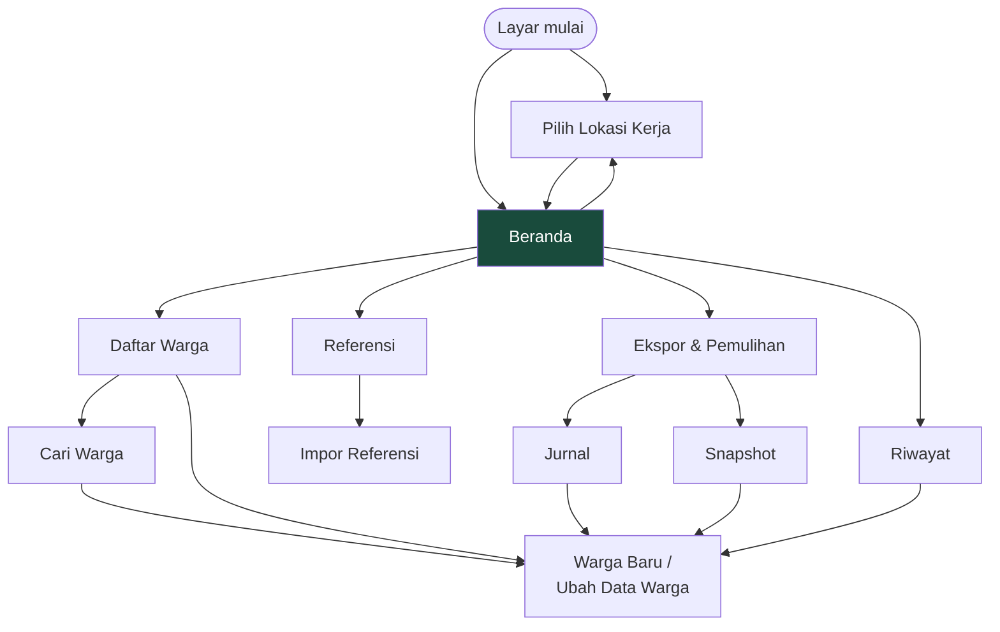

# TilikSuara · Pendataan DPS Offline

Aplikasi Flutter untuk Android, satu pengguna dan satu perangkat, sepenuhnya offline. Alat bantu pencatatan data pemilih: mencatat sesuai dokumen kependudukan asli, didukung pencarian pintar dan saran data referensi.

Versi 0.5.8 · Android 7.0+ · tanpa izin internet (dihapus eksplisit di manifest, dapat diverifikasi).

## Sekilas



## Yang Tidak Dilakukan Aplikasi Ini

- Tidak menghitung umur dan tidak menentukan kelayakan hak pilih warga.
- Tidak memakai kamera dan tidak memfoto dokumen kependudukan.
- Tidak menyentuh jaringan dalam bentuk apa pun dan menonaktifkan pencadangan otomatis cloud Android.
- Tidak mengubah data referensi. Referensi hanya dibaca untuk saran pengisian.
- Tidak membagikan berkas sendiri. Setiap pembagian ke aplikasi lain memerlukan tindakan dan konfirmasi eksplisit dari pengguna.

## Penggunaan di Lapangan

1. Instal APK dan buka aplikasi. Tidak ada izin yang diminta saat pertama kali dibuka. Izin akses berkas (Android 11+: Kelola Semua File, Android 7–10: izin penyimpanan biasa) baru diminta saat pertama kali mengekspor Excel, membuat berkas cadangan, atau mengimpor rujukan.
2. Impor referensi bersifat opsional. Bila memiliki berkas rujukan lama dalam format Excel atau CSV, pilih sheet yang relevan satu per satu (misalnya `RT 03`, `RT 04`, dan `RT 05`). Jangan mengimpor sheet rekapitulasi. Kolom dipetakan langsung di layar. Impor ulang diperbolehkan kapan saja. Layar Referensi menampilkan isi setiap berkas yang telah diimpor serta menyediakan pembersihan data referensi.
3. Saat pertama kali dibuka, tentukan lokasi kerja: pilih Provinsi → Kabupaten/Kota → Kecamatan → Desa/Kelurahan, atau ketik secara manual, atau lewati untuk diisi kemudian. RT dan RW ditentukan langsung oleh petugas sesuai penugasan. Setiap pergantian RT atau RW membuat snapshot di ruang privat, serta menulis cadangan zip dan salinan Excel otomatis di folder publik bila izin berkas sudah diberikan. Beranda menampilkan ringkasan jumlah warga dan catatan tanpa NIK per RT.
4. Daftar Warga adalah layar utama pendataan. Tekan `Tambah` di sudut kanan atas atau tombol tambah pada celah baris untuk menyisipkan warga baru, tahan ikon urutan untuk mengubah posisi susunan, dan geser kartu ke kiri untuk menghapus. Penomoran pada ekspor Excel mengikuti urutan susunan ini.
5. Cari Warga: ketik nama minimal 3 huruf. Bagian `Sudah Diinput` menampilkan data yang telah tersimpan. Bagian `Referensi` menampilkan saran dari berkas rujukan untuk mempercepat pengisian data baru. Tombol `Tambah Warga` selalu tersedia untuk input langsung. Mode pencarian tanggal lahir menampilkan seluruh kecocokan dengan memprioritaskan RT aktif.
6. Formulir mengutamakan nama lengkap, NIK, jenis kelamin, serta tempat dan tanggal lahir. NIK boleh dikosongkan bila belum tersedia pada dokumen. Validasi format NIK (panjang 16 digit, kesesuaian tanggal lahir dan jenis kelamin, deteksi NIK terdaftar) hanya pengingat ketelitian dan tidak memblokir penyimpanan. Kolom keterangan mendukung kode cepat maupun catatan bebas, lihat tabel di bawah.
7. Riwayat menampilkan 20 pencatatan terakhir. Jurnal mencatat setiap perubahan secara permanen per hari dan mendukung pengembalian versi sebelumnya serta pembatalan penghapusan warga. Hasil ekspor Excel selalu berupa beberapa berkas terpisah, lihat tabel berikutnya.

## Hasil Ekspor Excel

Menekan `Buat File Excel` menghasilkan berkas-berkas berikut di satu subfolder baru pada `ekspor/`. Duplikat selalu berupa berkas terpisah, bukan sheet di dalam berkas DPS.

| Berkas | Sheet | Isi |
|---|---|---|
| `DPS_<kode>_<desa>_RT<nn>_RW<mm>_<tanggal>.xlsx` | `RT <nn>`, `INFO` | Satu berkas per RT (bila opsi gabungan mati) |
| `DPS_GABUNGAN_<kode>_RW<mm>_<tanggal>.xlsx` | Satu sheet per RT, `INFO` | Seluruh RT dalam satu berkas (bila opsi gabungan aktif) |
| `DUPLIKAT_NIK_<kode>_<tanggal>.xlsx` | `DUPLIKAT NIK`, `INFO` | Baris dengan NIK yang sama, kolom NO memakai nomor urut di RT masing-masing (hanya dibuat bila ada duplikat) |
| `DUPLIKAT_NAMA_<kode>_<tanggal>.xlsx` | `DUPLIKAT NAMA`, `INFO` | Nama serupa dalam satu RW (hanya dibuat bila ada duplikat) |
| `TANPA_NIK_<kode>_<tanggal>.xlsx` | `TANPA NIK`, `INFO` | Baris yang NIK-nya masih kosong (hanya dibuat bila ada) |

Sheet data memakai sepuluh kolom: `NO`, `NAMA`, `NIK`, `JENIS KELAMIN`, `TEMPAT LAHIR`, `TANGGAL LAHIR`, `DESA`, `RT`, `RW`, `KETERANGAN`. Nomor `NO` mulai dari 1 di setiap RT. Sheet `INFO` memuat Provinsi, Kabupaten/Kota, Kecamatan, Desa/Kelurahan, Kode wilayah, RT, RW, Jumlah warga, Tanpa NIK, waktu ekspor, sumber kode wilayah, dan versi aplikasi. Nilai INFO dibaca dari snapshot tersimpan, bukan dari pack wilayah.

Ekspor otomatis saat pindah RT menulis salinan DPS yang sama ke `ekspor/otomatis/` (10 terbaru) tanpa berkas duplikat.

### Kode keterangan

Kolom `KETERANGAN` tetap teks bebas. Kode berikut dikenali sebagai pilihan cepat di formulir:

| Kode | Arti |
|---|---|
| TMS | Tidak Memenuhi Syarat |
| PD | Pindah Domisili |
| B | Baru |
| MD | Meninggal Dunia |

## Data dan Keamanan



Ruang privat tidak membutuhkan izin apa pun:

```text
pantarlih.db           SQLite (WAL)
journal/               satu JSONL per tanggal, append-only, tidak pernah dihapus
snapshot/              20 salinan database terbaru, rotasi otomatis
import/raw/            berkas sumber utuh, subfolder unik per percobaan
import/parsed/         data sel mentah sebelum normalisasi
import/ready/         data warga hasil normalisasi siap pakai
recovered/             database lama, direktori sementara cadangan_masuk, log crash dan error
```

Folder publik `Documents/Pantarlih<Desa>_<kode>/` hanya untuk pertukaran berkas dan hanya disentuh setelah pengguna memberi izin penyimpanan:

```text
ekspor/                hasil ekspor Excel pengguna, satu subfolder per ekspor
ekspor/otomatis/       salinan Excel saat berpindah RT atau RW, 10 terbaru
cadangan/              cadangan_<stamp>.zip berisi snapshot dan seluruh jurnal, 10 terbaru
impor/                 tempat meletakkan berkas rujukan agar mudah ditemukan aplikasi
```

Catatan keamanan:

- Data privat terhapus bila aplikasi dicopot. Berkas cadangan di folder publik tetap aman dan dapat dipulihkan kapan saja karena memuat snapshot database dan seluruh jurnal.
- Berkas cadangan tidak terenkripsi. Amankan perangkat dengan kunci layar dan salin folder cadangan berkala ke komputer lewat kabel USB.
- Folder `recovered/` memuat `crash_<stamp>.log` dan `error_<stamp>.log` yang dapat menyertakan data pribadi dari pesan exception. Berkas ini tersimpan di ruang privat dan tidak pernah dikirim ke mana pun karena aplikasi tidak memiliki akses jaringan.
- Izin yang diminta adalah akses berkas menyeluruh (Android 11+: Kelola Semua File, Android 7–10: izin penyimpanan biasa). Izin seluas ini dipilih karena aplikasi menulis ke folder Documents yang dipilih pengguna, bukan ke folder khusus aplikasi. Ini salah satu alasan aplikasi hanya didistribusikan lewat sideload dan bukan Play Store. Izin tidak pernah diminta saat aplikasi dibuka, hanya saat ekspor, impor, atau pencadangan yang diminta pengguna. Pergantian RT memeriksa izin secara diam-diam dan tidak pernah membuka dialog.
- Nama internal `pantarlih` (nama database, nama folder publik, nama entri zip) dipertahankan demi kompatibilitas dengan cadangan yang sudah ada di perangkat. Hanya nama tampilan yang berubah menjadi TilikSuara.
- Berkas rujukan pribadi di `data-exel/` diabaikan Git dan tidak dibundel ke APK (nama direktori historis, dipertahankan agar konsisten dengan `.gitignore` dan tes). Impor membutuhkan berkas di perangkat. Tes dengan berkas rujukan asli berjalan bila berkas tersedia lokal, tes sintetis tetap berjalan tanpa data pribadi.

## Ketahanan Data

Setiap aksi CGROGUAE melalui satu antrean terserialisasi dengan satu transaksi SQLite. Di dalam transaksi itu jurnal JSONL ditulis dan di-flush ke disk dahulu, baru perubahan diterapkan ke database. Gagal menulis jurnal berarti aksi dibatalkan. Gagal database setelah jurnal tertulis berarti aplikasi mengunci input dan meminta bangun ulang dari jurnal, bukan input ulang.



- Saat aplikasi dibuka, jurnal yang belum tercermin di database diputar ulang. Database yang hilang atau rusak dibangun ulang otomatis dari jurnal.
- Checkpoint (`setelan.jurnal_checkpoint`) mencatat id event terakhir yang diterapkan sehingga luncuran berikutnya melewati berkas lama. Checkpoint hanya maju bila pemutaran bersih, baris rusak terus dicoba ulang.
- Layar Snapshot menampilkan salinan database (jumlah warga, tanpa NIK, posisi jurnal) dengan pratinjau isi, perbandingan dengan data aktif, dan pemulihan ke titik waktu tertentu.
- Layar Jurnal menelusuri riwayat harian, menguji keutuhan data (tombol Periksa), mengembalikan versi sebelumnya, dan membatalkan penghapusan warga.
- Pemulihan snapshot mencatat event `RESTORE` berisi id event terakhir pada snapshot itu. Pemutaran ulang melewati rentang event yang dibatalkan pemulihan tersebut, sehingga rebuild menghasilkan keadaan yang sama dan tidak mengulang yang sudah dibatalkan.
- Pemulihan dari cadangan memakai `cadangan_<stamp>.zip` dari folder publik. Database dan jurnal aktif diamankan ke `recovered/` dahulu, tidak ada yang hilang.
- Baris JSONL rusak dilaporkan dan dilewati tanpa menghentikan pemulihan.
- NIK kosong maupun belum 16 digit tetap tersimpan. Peringatan format dan deteksi duplikat hanya pengingat.
- Urutan warga (`urut_sort`) memakai penomoran renggang kelipatan 1000 sehingga penyisipan tidak mengubah baris lain. Penataan ulang otomatis berjalan saat celah habis.
- Data referensi hanya-baca di aplikasi tanpa relasi kaku ke tabel warga, sehingga dapat dimuat ulang atau dibersihkan kapan saja.
- Normalisasi pencarian nama menangani variasi ejaan umum bahasa Indonesia.
- Pengurai Excel tangguh terhadap format tabel dan sel kosong dengan tetap menyimpan berkas asli di arsip.
- Data wilayah Kemendagri dibundel lokal (`assets/wilayah.db`) sebagai referensi statis baca-saja. Pilihan wilayah tersimpan sebagai snapshot di tabel `lokasi` dan tidak terpengaruh bila pack diperbarui.

## Arsitektur

Skema database v7 (`lib/data/schema.dart` adalah satu-satunya tempat bentuk skema didefinisikan, `lib/data/migrate.dart` menaikkan database lama bertahap):



Tiga hal yang tidak muat di diagram: `referensi` sengaja tanpa relasi kaku ke `warga` sehingga dapat dibersihkan kapan saja, `wilayah.db` adalah database terpisah yang read-only dan tidak pernah masuk jurnal, dan `schemaBaseVersion = 7` berarti instalasi baru langsung memakai bentuk final sementara database lama naik bertahap lewat `builtinUpgrades`. Dua view (`v_duplikat_nik` per NIK, `v_duplikat_nama` per nama dalam satu RW) mendasari laporan duplikat.

Peta layar (Beranda adalah hub):



Tabel berkas ke judul layar (diuji otomatis oleh `test/ui_conventions_test.dart`, setiap berkas layar wajib muncul di sini):

| Berkas | Judul |
|---|---|
| `lib/ui/home.dart` | Beranda |
| `lib/ui/lokasi_screen.dart` | Pilih Lokasi Kerja |
| `lib/ui/rt_list_screen.dart` | Daftar Warga |
| `lib/ui/search_screen.dart` | Cari Warga |
| `lib/ui/survey_form.dart` | Warga Baru, Ubah Data Warga |
| `lib/ui/history_screen.dart` | Riwayat · 20 Terakhir, Duplikat NIK, Duplikat Nama |
| `lib/ui/referensi_screen.dart` | Referensi |
| `lib/ui/import_screen.dart` | Impor Referensi |
| `lib/ui/admin_screen.dart` | Ekspor & Pemulihan |
| `lib/ui/journal_screen.dart` | Jurnal (plus rincian hari dan rincian catatan) |
| `lib/ui/snapshot_screen.dart` | Snapshot (plus Isi Snapshot dan Bandingkan Snapshot) |

Tanggung jawab berkas:

| Berkas | Tanggung jawab |
|---|---|
| `lib/main.dart` | Entry, layar mulai, penulisan `crash_<stamp>.log` privat |
| `lib/data/store.dart` | Satu-satunya penulis database dan jurnal, replay, snapshot, pemulihan |
| `lib/data/schema.dart` | Bentuk skema v7 |
| `lib/data/migrate.dart` | Migrasi event dan database lama |
| `lib/data/journal.dart` | Model baca jurnal untuk layar |
| `lib/data/exchange.dart` | Folder publik, tulis dan pulihkan cadangan zip |
| `lib/data/storage.dart` | Akar data privat, nama folder desa, izin penyimpanan |
| `lib/data/spreadsheets.dart` | Impor dan ekspor Excel |
| `lib/data/wilayah.dart` | Pack wilayah read-only dan snapshot lokasi |
| `lib/core/` | Format, nama, NIK, keterangan, info versi (murni, tanpa I/O) |

## Membangun dan Menjalankan

Toolchain yang terbukti membangun: Flutter 3.47.4 channel stable, Dart 3.13.3, JDK 17, `compileSdk = 37`, `minSdk = 24`, NDK mengikuti `flutter.ndkVersion`. `pubspec.yaml` membatasi Dart `>=3.3.0 <4.0.0`. Dependensi dikunci di `pubspec.lock`.

```sh
flutter pub get
flutter analyze
flutter test --concurrency=1   # sqflite_common_ffi berbagi direktori sementara, tes paralel membuatnya flaky
flutter run                    # pengembangan: build debug, mendukung hot reload
flutter build apk --release --split-per-abi   # produksi
```

Ukuran terukur 18 September 2026 (build penuh dengan pack wilayah nasional, `assets/wilayah.db` sekitar 13 MB): `app-arm64-v8a-release.apk` sekitar 24 MB, `app-debug.apk` sekitar 172 MB. Angka debug besar karena JIT dan hanya untuk pengembangan, jangan dipasang di lapangan.

APK produksi ada di `build/app/outputs/flutter-apk/` (satu APK per ABI, `arm64-v8a` untuk HP modern dan `armeabi-v7a` untuk HP lama). Build release lokal memakai signing key debug Android sehingga cocok untuk sideload perangkat tunggal, bukan publikasi Play Store. Gunakan keystore produksi yang dipertahankan untuk distribusi jangka panjang. Jangan uninstall untuk memperbarui, pasang APK bertanda tangan sama di atas versi lama.

Catatan kompatibilitas: UI memakai `ReorderableListView.onReorder` dan `DropdownButtonFormField.value` agar mesin dengan Flutter lebih lama tetap dapat mengompilasi. `value` sudah deprecated di Flutter modern dan pemakaiannya ditandai `// ignore: deprecated_member_use` yang disengaja. `flutter analyze` bersih karena penekanan itu, bukan karena bebas deprecation. Batas bawah Dart dinaikkan bila penekanan ini sudah lebih mengganggu daripada manfaatnya.

## Konvensi UI

- Semua teks antarmuka berbahasa Indonesia dan tidak mengandung titik koma (`;`).
- Tanpa huruf kapital semua (ALL CAPS). Judul dan tombol memakai Title Case (`Tambah Warga`, `Daftar Warga`, `Buat File Excel`). Aksi pembatal atau sekunder memakai Title Case atau kapital kalimat (`Batal`, `Tutup`, `Coba minta izin lagi`).
- Judul selalu nama halaman dalam Title Case, lihat tabel berkas ke judul di atas. Subtitle boleh memuat satu baris konteks (tanggal di Beranda, hitungan catatan di Jurnal dan Snapshot).
- Penggabung bagian teks memakai titik tengah dengan spasi (` · `), konsisten di seluruh layar.
- Format RT dan RW selalu dua digit dengan garis miring berjarak (`RT 03 / RW 02`).
- Aturan titik koma, elipsis, dan titik tengah ditegakkan otomatis oleh `test/ui_conventions_test.dart`, begitu pula kelengkapan tabel judul layar dan larangan spasi ganda di dalam string antarmuka.

## Pengujian

| Berkas tes | Cakupan |
|---|---|
| `test/core_test.dart` | Normalisasi nama, fuzzy matching, tanggal DD-first, NIK sebagai peringatan |
| `test/store_test.dart` | Sisip, geser, renumber, duplikat, replay identik termasuk `urut_sort`, baris jurnal terpotong, database hilang, kegagalan tulis jurnal, snapshot dan perubahan sesi |
| `test/storage_test.dart` | Nama folder desa, akar data privat, folder pertukaran, rotasi cadangan |
| `test/search_screen_test.dart`, `test/rt_list_screen_test.dart` | Layar Cari dan Daftar Warga |
| `test/wilayah_test.dart` | Isi pack wilayah, `WilayahRepo`, ketahanan pack rusak |
| `test/app_info_test.dart` | Versi aplikasi sinkron antara `pubspec.yaml` dan kode |
| `test/ui_conventions_test.dart` | Aturan string UI dan kelengkapan tabel judul layar di README ini |
| `test/widget_test.dart` | Luncuran aplikasi |

Sebelum dipakai di lapangan, uji singkat di HP sasaran: izin, impor, simpan, sisip, ekspor, dan pemulihan. Tes impor 504 baris memakai berkas rujukan asli dan dilewati bila berkas tidak tersedia lokal.

## Data Wilayah dan Atribusi

Pack wilayah Kemendagri dibundel sebagai aset baca-saja (`assets/wilayah.db`, 91.599 baris: 38 provinsi, 514 kabupaten/kota, 7.285 kecamatan, 83.762 desa). Detail bentuk data, skema pack, cara membangun ulang, dan keputusan desain ada di [`docs/wilayah.md`](docs/wilayah.md).

**Memperbarui pack tidak pernah mengubah data yang sudah tersimpan.** Nama wilayah pada setiap baris warga dan pada tabel `lokasi` adalah snapshot.

Sumber: [cahyadsn/wilayah](https://github.com/cahyadsn/wilayah) oleh Cahya DSN, lisensi MIT, mengikuti Kepmendagri No. 300.2.2-2430 Tahun 2025. Teks lisensi sumber ada di `third_party/wilayah/LICENSE`, SHA dan tanggal unduh di `third_party/wilayah/SOURCE.txt`.

## Lisensi

Aplikasi ini berlisensi MIT, lihat berkas `LICENSE`. Data nama dan kode wilayah yang dibundel berasal dari proyek WILAYAH (<https://github.com/cahyadsn/wilayah>), Copyright (c) 2017-2025 Cahya DSN, lisensi MIT.
