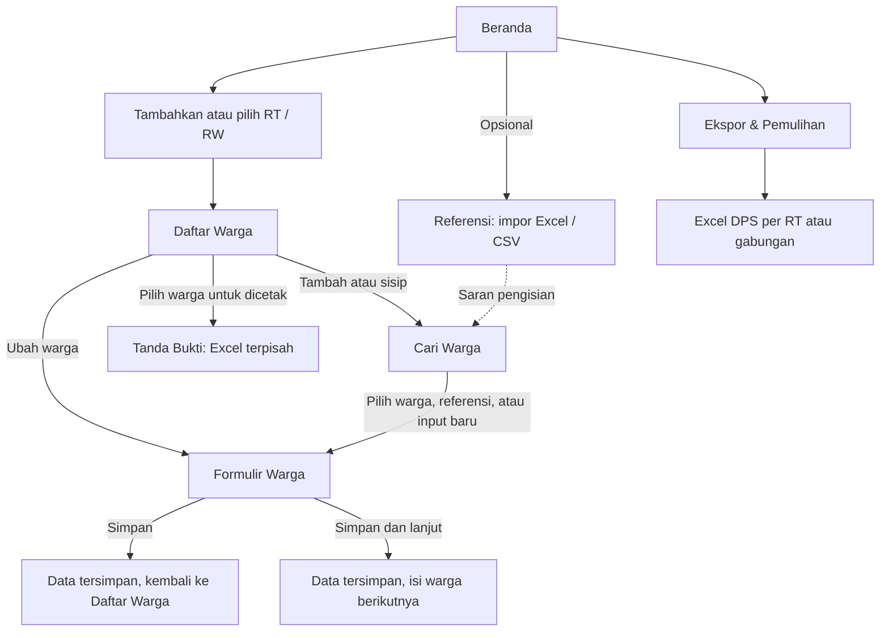
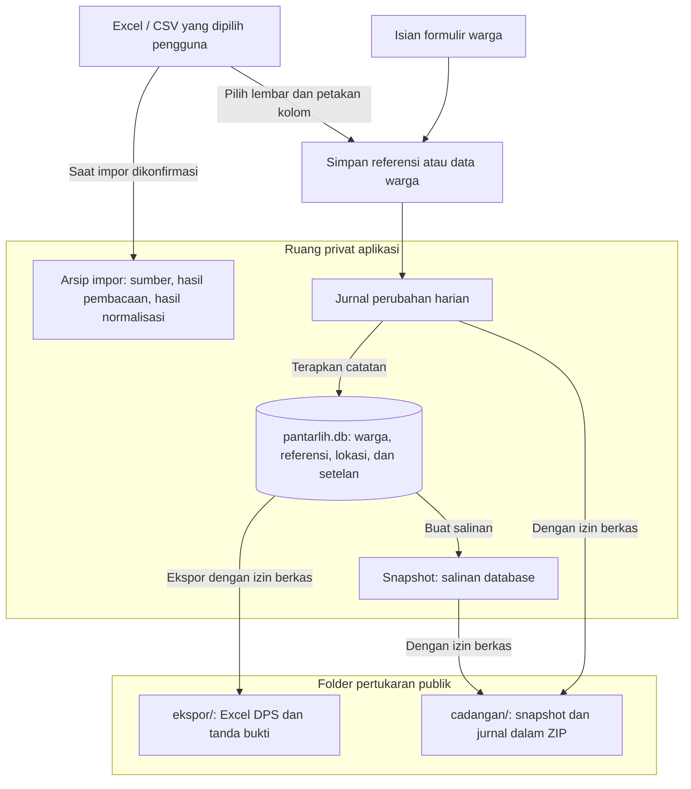

# TilikSuara

**Pendataan pemilih dari lapangan, tetap berjalan tanpa internet.**

TilikSuara membantu petugas mencatat data warga untuk Daftar Pemilih Sementara (DPS), memeriksa isian, dan menyiapkan rekap Excel. Dirancang untuk satu petugas di satu perangkat Android, dengan data yang tersimpan di ponsel.

Satu ruang kerja digunakan untuk **satu desa**, dengan beberapa RT / RW. Desa tidak dapat diganti selama masih ada data warga atau referensi, agar rekap dari desa yang berbeda tidak tercampur.

**Android 7.0+ · Tanpa akun · Sepenuhnya offline · Lisensi MIT**

[Mulai Menggunakan](#mulai-menggunakan) · [Alur Pendataan](#alur-pendataan) · [Ekspor](#ekspor-dan-tanda-bukti) · [Privasi](#privasi-dan-penyimpanan) · [Pengembangan](#pengembangan)

## Fitur

| Kebutuhan | Yang tersedia |
| --- | --- |
| Mengatur wilayah kerja | Pilihan provinsi hingga desa dari data wilayah bawaan, isian manual, serta beberapa RT / RW dalam satu wilayah kerja. |
| Mencatat warga | Formulir identitas, keterangan, persentase kelengkapan, draf warga baru, dan **Simpan & Lanjut** untuk pendataan berurutan. |
| Menata daftar | Sisip sebelum atau sesudah warga, ubah urutan, penanda warna, pencarian, dan filter keterangan. |
| Mencari data | Pencarian nama dengan toleransi variasi ejaan atau pencarian tanggal lahir, dengan prioritas RT aktif. |
| Memakai data lama | Impor `.xlsx` atau `.csv`, pilih lembar dan petakan kolom, lalu gunakan referensi untuk membantu pengisian. Referensi yang memenuhi persyaratan isian dapat dijadikan data warga satu per satu atau sekaligus. |
| Memeriksa isian | Pengingat format NIK, kesesuaian tanggal lahir dan jenis kelamin, daftar duplikat NIK atau nama, serta catatan tanpa NIK. |
| Menyiapkan hasil | Excel per RT atau gabungan, lembar temuan, kop opsional, dan tanda bukti untuk warga terpilih. |
| Menelusuri perubahan | Riwayat terbaru, jurnal perubahan, salinan data otomatis, perbandingan isi, dan pemulihan cadangan. |

TilikSuara membantu pencatatan, bukan menentukan hak pilih. Data tetap perlu dicocokkan dengan dokumen kependudukan. Aplikasi tidak menghitung kelayakan berdasarkan usia dan tidak mengambil foto dokumen.

## Mulai Menggunakan

1. **Pasang APK dan tentukan lokasi kerja.** Pilih wilayah dari daftar atau isi secara manual. Aplikasi tidak meminta izin penyimpanan saat pertama dibuka.
2. **Tambahkan RT / RW di Beranda.** Pilih RT yang sedang dikerjakan. Ringkasan jumlah warga dan isian tanpa NIK tersedia pada kartu wilayah kerja.
3. **Impor referensi jika diperlukan.** Buka **Referensi → Impor Berkas**, pilih Excel atau CSV, lalu periksa pemetaan kolom. Untuk berkas dengan beberapa lembar, impor lembar data RT satu per satu.
4. **Mulai dari Daftar Warga.** Tekan **Tambah**, cari warga yang sudah tercatat atau referensi yang sesuai, lalu lengkapi formulir. NIK boleh dikosongkan jika belum tersedia. Pengingat NIK tidak menghalangi penyimpanan, sedangkan NIK ganda meminta konfirmasi.
5. **Periksa dan ekspor.** Buka **Ekspor & Pemulihan** untuk memeriksa duplikat dan membuat Excel. Urutan hasil ekspor mengikuti susunan warga yang disimpan.
6. **Buat cadangan sebelum selesai.** Gunakan **Buat Snapshot Sekarang**, izinkan akses berkas agar salinan ZIP tersimpan di luar aplikasi, lalu salin cadangan secara berkala ke tempat yang aman.

Pada formulir, keterangan dapat berupa catatan bebas atau pilihan cepat: **TMS** (Tidak Memenuhi Syarat), **PD** (Pindah Domisili), **B** (Baru), dan **MD** (Meninggal Dunia).

### Alur Pendataan

Pada penggunaan pertama, aplikasi menawarkan pilihan lokasi yang bisa diisi atau dilewati. Alur berikut menunjukkan pendataan melalui **Daftar Warga**, setelah RT / RW aktif ditentukan di Beranda.



Tombol **Tambah Warga** di Beranda juga membuka pencarian. Bila dibuka dari sana, **Simpan** mengembalikan pengguna ke Beranda. Referensi tetap terpisah dari data warga sampai disimpan lewat formulir atau ditambahkan melalui aksi **Promosikan Referensi**.

## Ekspor dan Tanda Bukti

### Rekap DPS

Menu **Ekspor & Pemulihan** menyediakan pilihan RT aktif atau semua RT pada RW aktif, satu berkas per RT atau satu berkas gabungan, serta kop di atas tabel.

| Isi berkas Excel | Keterangan |
| --- | --- |
| Lembar RT | Nomor, nama, NIK, jenis kelamin, tempat dan tanggal lahir, desa, RT, RW, serta keterangan. Nomor dimulai dari 1 pada setiap RT. |
| Lembar temuan | `DUPLIKAT NIK`, `DUPLIKAT NAMA`, dan `TANPA NIK` muncul jika ada data yang perlu diperiksa. |
| `INFO` | Identitas wilayah, jumlah warga, waktu ekspor, dan informasi aplikasi. |

Setiap ekspor DPS manual masuk ke folder baru di `ekspor/`. Berkas dapat dibuka dengan aplikasi spreadsheet atau dibagikan setelah konfirmasi. Membuat berkas tidak otomatis mengirimkannya. Salinan DPS otomatis saat berganti RT tidak menyertakan lembar temuan.

### Tanda Bukti

Dari menu **Daftar Warga → Tanda Bukti**, pilih warga dan lengkapi informasi cetak untuk menghasilkan berkas Excel langsung di `ekspor/`. Status perkawinan, pilihan dokumen, serta nama kepala rumah tangga, petugas, dan penerima hanya dipakai untuk tanda bukti tersebut. Isian ini tidak menambah atau mengubah data utama warga.

## Privasi dan Penyimpanan

APK release tidak memiliki izin internet. Data utama, jurnal, salinan data, dan arsip impor disimpan di ruang privat aplikasi. Pencadangan otomatis Android dinonaktifkan dalam konfigurasi aplikasi.

| Lokasi | Isi dan penggunaan |
| --- | --- |
| Ruang privat aplikasi | Data warga dan referensi, jurnal perubahan, snapshot, serta arsip impor dan pemulihan. Pendataan tidak memerlukan izin penyimpanan publik. |
| `Documents/Pantarlih<Desa>_<kode>/ekspor/` | Excel DPS dan tanda bukti. Salinan Excel otomatis berada di `otomatis/`. |
| `Documents/Pantarlih<Desa>_<kode>/cadangan/` | Cadangan ZIP berisi salinan basis data dan jurnal perubahan. |
| `Documents/Pantarlih<Desa>_<kode>/impor/` | Tempat menaruh berkas referensi agar mudah ditemukan. |

Nama folder menyesuaikan desa dan kode wilayah yang tersedia. Nama `Pantarlih` tetap digunakan agar kompatibel dengan berkas dari versi sebelumnya. Pada perangkat tertentu, aplikasi memakai folder `Dokumen` jika `Documents` belum tersedia.

Izin akses berkas diminta saat menulis ekspor atau cadangan ke folder publik. Android 11 ke atas menggunakan izin **Kelola Semua File**, sementara Android 7–10 menggunakan izin penyimpanan. Impor referensi dan pemulihan ZIP memakai pemilih berkas sistem, tanpa meminta izin Kelola Semua File. Berkas sumber boleh dipilih dari lokasi lain, tidak wajib ditempatkan di `impor/`. Berpindah RT hanya memeriksa izin yang sudah diberikan.

### Alur Penyimpanan



Diagram merangkum jalur data yang sudah disimpan. Draf formulir dan pengaturan kode keterangan ditulis langsung ke setelan, tanpa membuat catatan jurnal tersendiri. Saat warga disimpan, draf milik formulir tersebut dibersihkan dalam transaksi yang sama.

ZIP cadangan memuat satu salinan database dan seluruh berkas jurnal yang tersedia saat ZIP dibuat. Arsip sumber impor, berkas Excel hasil ekspor, dan kumpulan snapshot lainnya tidak ikut dimasukkan. Data referensi hasil impor tetap tercakup karena tersimpan di database dan jurnal.

**Data dan cadangan tidak dienkripsi oleh aplikasi.** Gunakan kunci layar, simpan salinan cadangan di tempat aman, dan pilih penerima berkas dengan cermat. Aplikasi lain yang dipilih untuk membuka atau membagikan Excel dapat memiliki akses internet sendiri.

**Menghapus aplikasi atau menghapus data aplikasi akan menghilangkan data privat.** Cadangan yang sudah tersimpan di folder publik terpisah dari data tersebut. Pastikan ZIP cadangan tersedia dan telah disalin sebelum mengganti perangkat atau menghapus aplikasi. Excel adalah rekap, bukan pengganti cadangan pemulihan.

## Cadangan dan Pemulihan

Perubahan warga, referensi, lokasi, dan wilayah kerja dicatat ke jurnal sebelum diterapkan ke basis data. Saat aplikasi dibuka, catatan yang belum diterapkan dapat diputar ulang. Jurnal juga dipakai untuk membangun ulang data saat diperlukan.

- Saat memilih kartu RT / RW lain yang sudah ada di Beranda, aplikasi membuat **snapshot** di ruang privat. Bila izin berkas sudah tersedia, aplikasi kemudian mencoba membuat ZIP dan Excel otomatis untuk RT yang ditinggalkan. Kegagalan penulisan publik ditampilkan sebagai pemberitahuan.
- Menambah atau melepas RT / RW tidak menjalankan alur cadangan otomatis tersebut. Gunakan **Buat Snapshot Sekarang** jika membutuhkan cadangan saat itu juga.
- Aplikasi mempertahankan **20 snapshot rutin terbaru**, **10 cadangan ZIP terbaru per folder cadangan**, dan **10 folder ekspor otomatis terbaru per folder desa**. Ekspor manual serta salinan khusus migrasi dan pemulihan tidak mengikuti rotasi ini.
- **Snapshot** menyediakan pratinjau, perbandingan dengan data aktif, dan pemulihan ke salinan yang dipilih.
- **Jurnal** menyediakan penelusuran perubahan, pemeriksaan catatan, pengembalian versi, dan pembatalan penghapusan warga.
- **Pulihkan dari Cadangan** memeriksa salinan database dan memutar ulang jurnal ZIP di ruang sementara sebelum mengganti data aktif. Hasilnya mengikuti catatan terakhir dalam ZIP, yang bisa lebih baru daripada snapshot di dalamnya. Perubahan yang hanya ada di perangkat setelah ZIP dibuat tidak ikut terbawa. Database dan jurnal sebelumnya diamankan, dan kegagalan penggantian ditangani dengan pengembalian pasangan lama.

Cadangan pada ponsel yang sama belum melindungi dari kehilangan atau kerusakan perangkat. Salin ZIP terbaru secara berkala, misalnya ke komputer melalui USB.

## Pengembangan

Proyek menggunakan Flutter, SQLite melalui `sqflite`, dan paket `excel`. Versi aplikasi serta batas SDK tersedia di [`pubspec.yaml`](pubspec.yaml), dependensi terkunci di [`pubspec.lock`](pubspec.lock), dan konfigurasi Android berada di [`android/app/build.gradle.kts`](android/app/build.gradle.kts).

Siapkan Flutter yang kompatibel dengan dependensi terkunci, Android SDK yang sesuai konfigurasi proyek, dan **JDK 17**.

```sh
flutter pub get
flutter analyze
flutter test --concurrency=1
flutter build apk --release --split-per-abi
```

Jalankan tes secara berurutan karena pengujian SQLite memakai `sqflite_common_ffi`. Tes meliputi aturan data, urutan warga, jurnal dan pemulihan, impor-ekspor, serta perilaku layar. Beberapa tes impor dengan berkas pribadi hanya berjalan jika berkas tersedia lokal. Berkas tersebut tidak dibundel ke APK.

Impor memeriksa isi ZIP dan Excel sebelum diproses, termasuk ukuran setelah diekstrak dan jumlah sel yang perlu dimuat. Jika berkas terlalu besar, pisahkan menjadi beberapa berkas yang lebih kecil atau hapus baris dan kolom kosong yang jauh dari tabel.

APK hasil build berada di `build/app/outputs/flutter-apk/`. Pilih varian ABI yang sesuai perangkat. Untuk mengembangkan pada perangkat yang sudah berisi data, buat cadangan terlebih dahulu dan pertahankan identitas paket serta kunci penandatanganan saat memperbarui.

> **Penandatanganan APK:** konfigurasi release saat ini menggunakan kunci debug Android untuk pemasangan langsung. Kunci tersebut bergantung pada lingkungan build, sehingga build dari komputer lain belum tentu dapat memperbarui instalasi yang sama. Distribusi jangka panjang memerlukan kunci penandatanganan tetap yang disimpan dengan aman. Mengganti kunci tidak otomatis kompatibel dengan instalasi lama, dan menghapus aplikasi untuk mengatasi masalah tanda tangan akan menghapus data privatnya.

### Model Data

Ringkasan ini mengikuti [`lib/data/schema.dart`](lib/data/schema.dart). Nama kolom dan aturan lengkap tetap mengacu ke skema tersebut.

| Tabel | Isi dan hubungan |
| --- | --- |
| `warga` | Data hasil pendataan. `id` adalah kunci utama, sedangkan urutan unik berlaku pada gabungan `rw`, `rt`, dan `urut_sort`. NIK boleh kosong atau sama dengan warga lain, dengan pengingat di aplikasi. |
| `referensi` | Hasil impor beserta berkas dan baris sumber. Tidak ada foreign key ke `warga`, sehingga membersihkan referensi tidak menghapus warga yang sudah disimpan. |
| `lokasi` | Salinan identitas wilayah yang dipilih, berkunci `kode`. Kolom `kode_wilayah` pada warga dan referensi menyimpan kode tersebut, tetapi tidak didefinisikan sebagai foreign key. |
| `setelan` | Pasangan kunci-nilai untuk lokasi aktif, daftar RT / RW, draf, serta pengaturan aplikasi. Lokasi aktif ditunjuk oleh `kode_wilayah_aktif`. |
| `log` | Catatan peristiwa yang sudah diterapkan ke database. Jurnal berkas harian disimpan terpisah untuk pemulihan. |
| `urutan_id` | Nomor terakhir per tabel, untuk menjaga penomoran saat penyimpanan dan pemulihan. |

`v_duplikat_nik` mengelompokkan NIK yang sama di seluruh data warga, sedangkan `v_duplikat_nama` mengelompokkan nama yang sudah dinormalisasi dalam RW yang sama. Keduanya merupakan view untuk pemeriksaan, bukan tabel warga tambahan. Ekspor menyaring baris temuan sesuai cakupan RT / RW yang dipilih.

Data wilayah bawaan ada di database terpisah, `assets/wilayah.db`, dan dibaca saja. Data tersebut bukan tabel warga dan tidak ikut dimasukkan ke jurnal atau ZIP cadangan.

### Peta Kode

| Lokasi | Peran |
| --- | --- |
| `lib/main.dart` | Inisialisasi aplikasi dan alur pertama kali dibuka. |
| `lib/core/` | Format, normalisasi nama, pemeriksaan NIK, dan keterangan. |
| `lib/data/store.dart` | Penyimpanan data, jurnal, snapshot, dan pemulihan. |
| `lib/data/schema.dart`, `lib/data/migrate.dart` | Skema dan migrasi data. |
| `lib/data/storage.dart`, `lib/data/exchange.dart` | Penyimpanan privat, izin, folder pertukaran, dan cadangan ZIP. |
| `lib/data/spreadsheets.dart` | Impor referensi, ekspor DPS, dan tanda bukti. |
| `lib/data/wilayah.dart`, `lib/data/journal.dart` | Data wilayah dan pembacaan jurnal. |
| `lib/ui/common.dart` | Komponen bersama dan konteks wilayah kerja. |

### Peta Layar

| Berkas | Layar |
| --- | --- |
| `lib/ui/home.dart` | Beranda |
| `lib/ui/lokasi_screen.dart` | Pilih Lokasi Kerja |
| `lib/ui/rt_list_screen.dart` | Daftar Warga |
| `lib/ui/search_screen.dart` | Cari Warga |
| `lib/ui/survey_form.dart` | Warga Baru dan Ubah Data Warga |
| `lib/ui/referensi_screen.dart` | Referensi dan Belum Diinput |
| `lib/ui/import_screen.dart` | Impor Referensi |
| `lib/ui/history_screen.dart` | Riwayat, Duplikat NIK, dan Duplikat Nama |
| `lib/ui/admin_screen.dart` | Ekspor & Pemulihan |
| `lib/ui/snapshot_screen.dart` | Snapshot, Isi Snapshot, dan Bandingkan Snapshot |
| `lib/ui/journal_screen.dart` | Jurnal dan rincian catatan |
| `lib/ui/tanda_bukti_screen.dart` | Tanda Bukti dan Konfigurasi Tanda Bukti |

Antarmuka menggunakan bahasa Indonesia. Pesan kesalahan harus menjelaskan tindakan yang bisa dilakukan pengguna, tanpa menampilkan rincian teknis. Saat melaporkan masalah atau mengirim perubahan, gunakan data contoh dan hindari menyertakan NIK, berkas warga, cadangan, atau log pribadi.

## Data Wilayah dan Lisensi

Nama dan kode wilayah dibundel untuk penggunaan offline dari proyek [WILAYAH oleh Cahya DSN](https://github.com/cahyadsn/wilayah), berlisensi MIT. Asal versi data dicatat di [`third_party/wilayah/SOURCE.txt`](third_party/wilayah/SOURCE.txt), dengan lisensi sumber di [`third_party/wilayah/LICENSE`](third_party/wilayah/LICENSE). Panduan aset wilayah tersedia di [`docs/wilayah.md`](docs/wilayah.md).

Memperbarui aset wilayah tidak otomatis mengubah nama wilayah pada data warga yang sudah disimpan.

Kode aplikasi menggunakan [Lisensi MIT](LICENSE).
